# Landing Page - iPhone 17 Pro

**Website:** [https://landingpagecmt.online/](https://landingpagecmt.online/)

Đây là dự án thực tập phát triển website cho Healthy Living Corporation (HeliCorp), với mục tiêu xây dựng một trang Landing Page giới thiệu sản phẩm (iPhone 17 Pro) theo phong cách hiện đại, kết hợp với các tính năng thương mại điện tử mini và tích hợp trí tuệ nhân tạo (Chatbot AI).

## 🚀 Công Nghệ Sử Dụng

### Frontend

- **Framework:** ReactJS (Vite)
- **Styling:** CSS thuần kết hợp các biến CSS (CSS Variables) để dễ dàng quản lý chủ đề.
- **Hoạt ảnh (Animation):** Framer Motion (cho các tương tác Micro-interactions và Scroll Animation).
- **Icons & UI:** Lucide React, React Hot Toast (cho thông báo người dùng).

### Backend

- **Framework:** Python với FastAPI.
- **Cơ sở dữ liệu:** MongoDB.
- **AI/LLM:** Tích hợp API của Groq (Llama-3.1-8b) xử lý tác vụ Chatbot tư vấn trực tuyến.

### Authentication & Bảo Mật

- **Cơ chế xác thực:** JWT (JSON Web Tokens).
- Sử dụng cặp **Access Token** và **Refresh Token** để đảm bảo bảo mật và gia hạn phiên đăng nhập một cách mượt mà không gây gián đoạn trải nghiệm người dùng.
- Mật khẩu người dùng được mã hóa (hashing) trước khi lưu vào cơ sở dữ liệu.

**Tài khoản đăng nhập mẫu:**

- **Email:** `test@landingpage.com`
- **Mật khẩu:** `123456`

---

## 🌟 Chức Năng Nổi Bật

- **Tính năng Thương Mại Điện Tử Mini:**

  - Đăng ký, đăng nhập và quản lý tài khoản.
  - Lưu sản phẩm yêu thích.
  - Thêm sản phẩm vào giỏ hàng, cập nhật số lượng và tính tổng tiền.
  - Theo dõi danh sách các sản phẩm đã xem (Viewed Products) gần đây.
  - Dữ liệu giỏ hàng và yêu thích được đồng bộ hóa lên MongoDB mỗi khi người dùng có thao tác.
- **Tư Vấn Viên AI (Chatbot Trực Tuyến):**

  - Tích hợp cửa sổ Chatbot ở góc phải màn hình.
- **Theo Dõi Hành Vi (Tracking Webhook):**

  - Ghi nhận hành vi của người dùng (Click chuột, mức độ cuộn trang).
  - Dữ liệu được gửi ngầm về backend thông qua webhook để phục vụ phân tích.

---

## ✨ Điểm Cộng Đã Đạt Được

- [X] **Webhook & Tracking:** Tích hợp kiểm tra tính hợp lệ dữ liệu gửi về Webhook thực tế kết hợp ghi nhận hành vi (click, scroll) một cách tối ưu.
- [X] **Chế Độ Giao Diện (Dark Mode):** Hệ thống cho phép người dùng chuyển đổi mượt mà giữa chế độ Sáng và Tối.
- [X] **Nâng Cao Trải Nghiệm & Hiệu Ứng:**
  - *Scroll Animation:* Các phần tử tự động xuất hiện mượt mà khi cuộn tới (Sử dụng Intersection Observer/Framer Motion).
  - *Skeleton Loading:* Hiệu ứng khung tải trang được áp dụng cho danh sách sản phẩm và Chatbot trong thời gian chờ dữ liệu.
  - *Micro-interactions:* Các hiệu ứng tương tác vi mô trực quan khi người dùng trỏ chuột (hover) hoặc bấm (tap) vào nút bấm.
- [X] **Tích hợp Backend hoàn chỉnh:** Thiết kế hệ thống cơ sở dữ liệu để lưu trữ trạng thái người dùng (Giỏ hàng, Yêu thích) thay vì chỉ lưu ở LocalStorage.
- [X] **Thiết kế tối ưu & Mượt mà:** Giao diện tập trung làm nổi bật sản phẩm với bố cục sạch sẽ, sang trọng, mang lại cảm giác cao cấp.

---

## 📈 Kết Quả & Hình Ảnh Minh Chứng

Dưới đây là một số hình ảnh minh chứng cho các chức năng và kết quả kiểm thử của dự án:

### 1. Hiệu Suất Tối Ưu (Google PageSpeed Insights)

Dự án được tối ưu hoá tối đa, giúp đạt điểm số rất cao trên nền tảng di động.
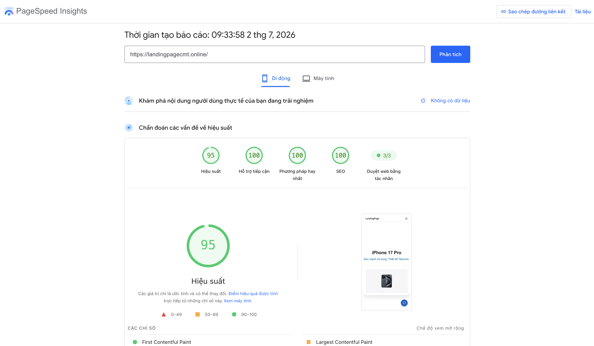

### 2. Điểm SEO & Accessibility

Tối ưu hóa các thẻ meta, cấu trúc HTML và aria-labels để đạt điểm tuyệt đối.
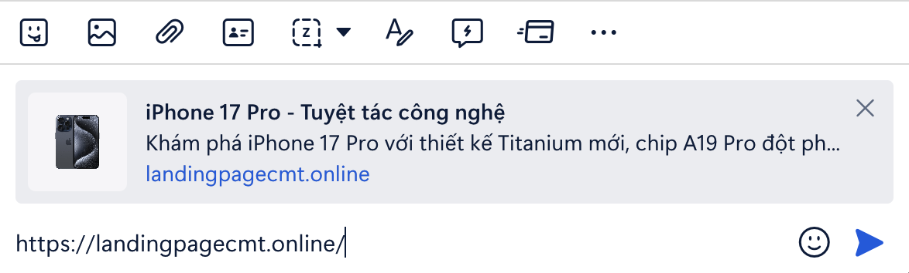

### 3. Trải Nghiệm Mượt Mà và Chế độ Tối

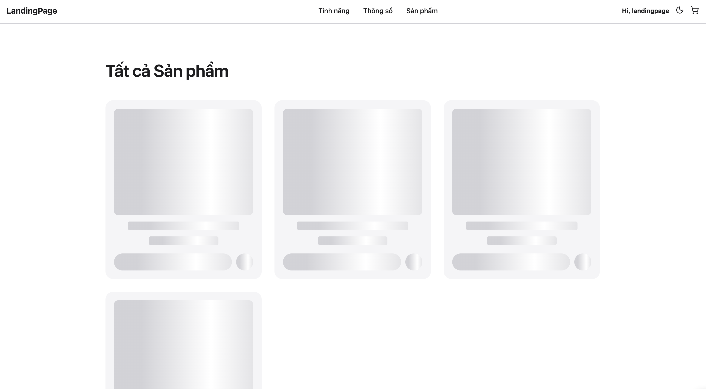
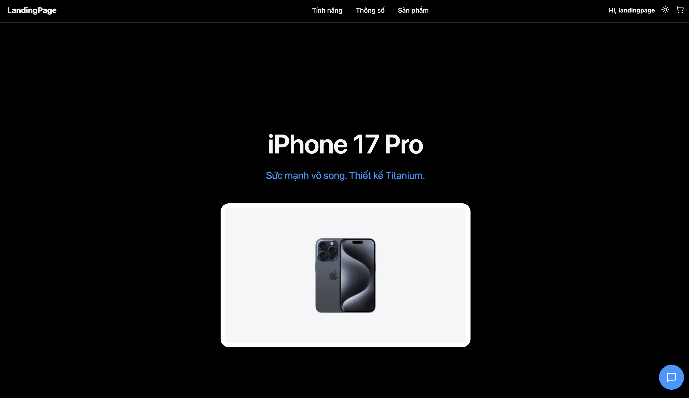

### 4. Tính Năng Thương Mại Điện Tử

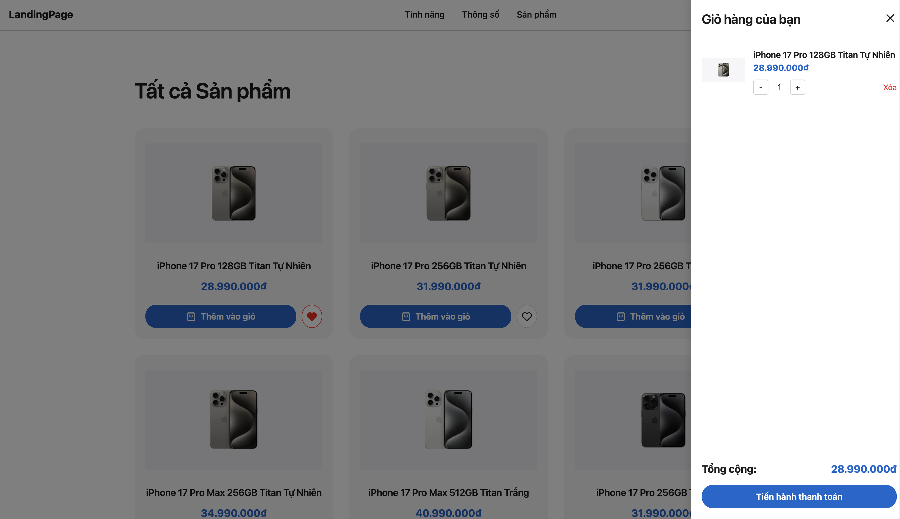
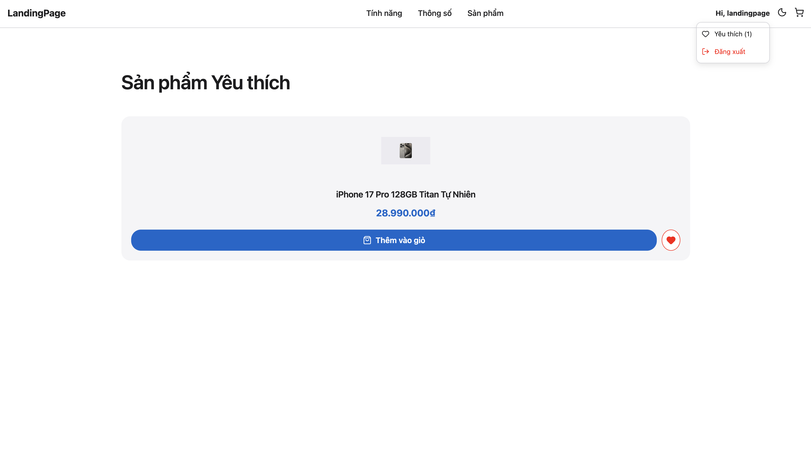
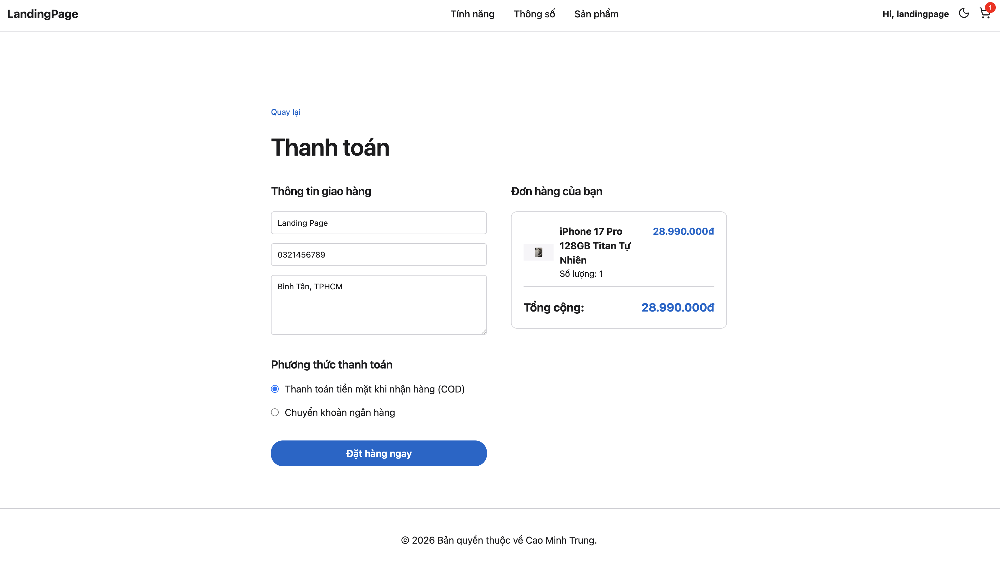

### 5. Tư Vấn Viên AI

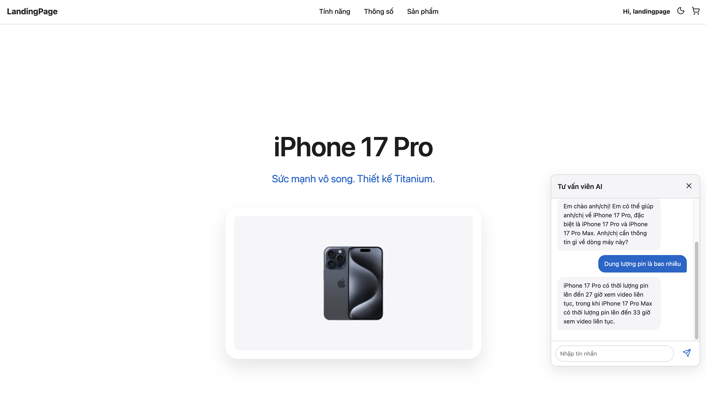

### 6. Quản Trị Cơ Sở Dữ Liệu

Dữ liệu người dùng và lịch sử tương tác được lưu trữ phân bạch, rõ ràng trên MongoDB.
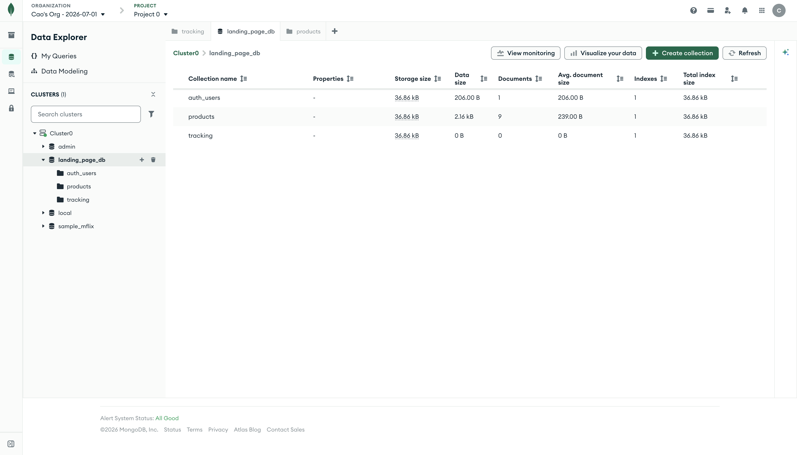
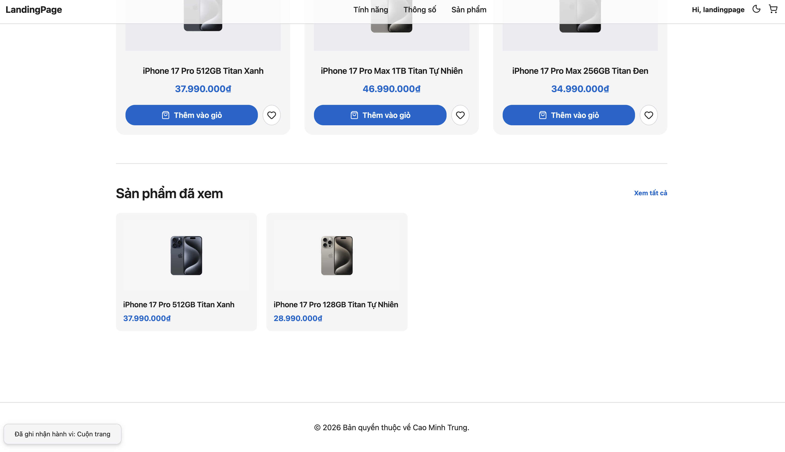
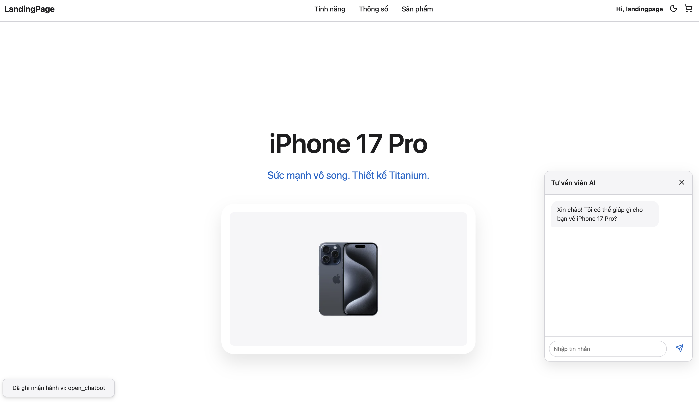
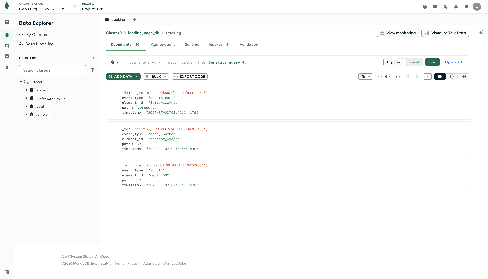
